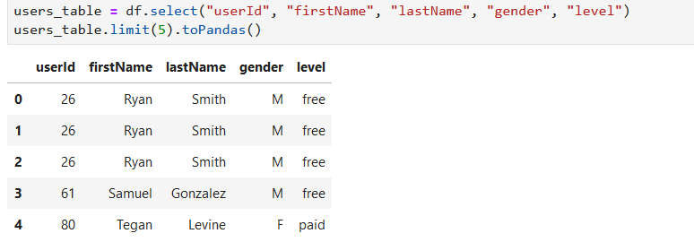
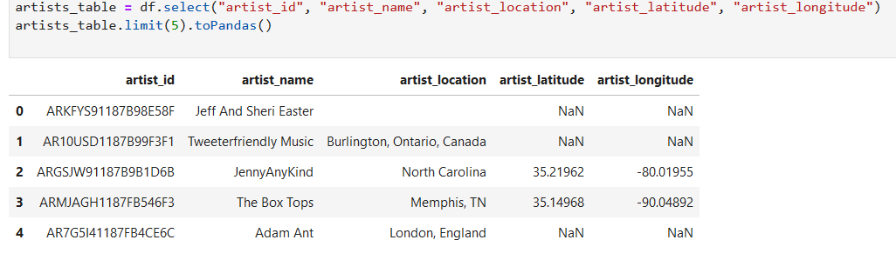
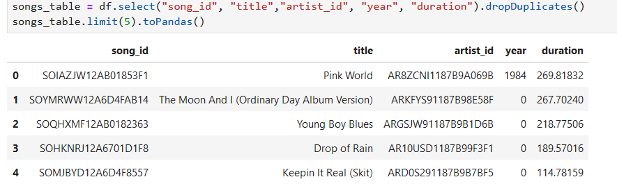
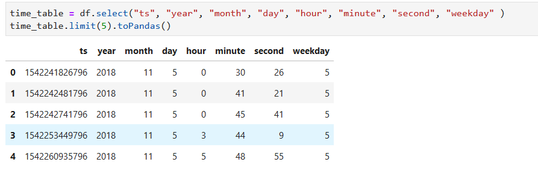

# Data Lake for Sparkify on AWS
****

# Purpose
****
As scalability could be a problem when users and songs dataset increases, migrating to well maintained and very scalable environment(i.e cloud) is an ideal solution. The Original raw data from sparkify music streaming app are composed of Song dataset and log dataset, they are stored in a AWS S3 bucket in JSON format. During processing, from user log and song metadata JSON files all needed column are extracted to create the respective table and will be written to output well structured parquet files. 

# Approach
****
For better scalabilty and mainainablity files from sparkify music streaming app are now stored in Amazon S3 bucket. With ETL pipline the columns are extracted out from the raw dataset in S3 bucket and duplicated entries are dropped so that all 5 tables will be created out of the extracted columns. Each created table then will be written to parqet file, songs table is written to parquet files partitioned by year and artist, time table is written to parquet files partitioned by year and month and songplays table is writen to parquet files partitioned by year and month. For table songplays, columns are extracted from joined song and log datasets.  

### steps to run pipeline
- %run etl.py

# Sample query
***

